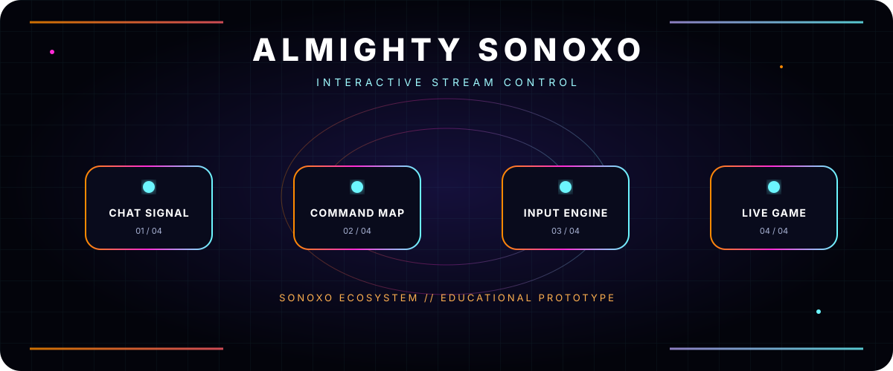

<div align="center">



# ALMIGHTY SONOXO

**INTERACTIVE STREAM CONTROL**

[](https://github.com/sonoxo)


</div>

## What this repository is

A Python Twitch Plays prototype that translates Twitch or YouTube chat messages into keyboard and mouse actions for interactive game streams.

## How it works

1. **Chat signal** — the connection module reads chat.
2. **Command map** — you define allowed messages in `TwitchPlays_TEMPLATE.py`.
3. **Input engine** — mapped commands produce keyboard or mouse input.
4. **Live game** — viewers influence the game through those approved mappings.

## Beginner setup

Install Python 3.9 and the required packages:

```bash
python -m pip install keyboard pydirectinput pyautogui pynput requests
```

Set your Twitch username or YouTube channel ID in `TwitchPlays_TEMPLATE.py`, review every input mapping, then run the template.

> This software can control your computer input. Test it in a safe environment and keep an emergency stop available.

## Project status

**Educational prototype.** It is not presented as a hosted Sonoxo service or production automation platform.

## Origin and license

This code is based on **Wituz’s Twitch Plays template**, expanded by **DougDoug** and **DDarknut**, with YouTube-side help from **Ottomated**. That authorship is preserved. See [LICENSE](LICENSE), which retains DougDoug’s MIT copyright notice.

---

<div align="center">

**SONOXO ECOSYSTEM** · Built to make complex tools understandable

The header animation automatically becomes static when your system requests reduced motion.

</div>
